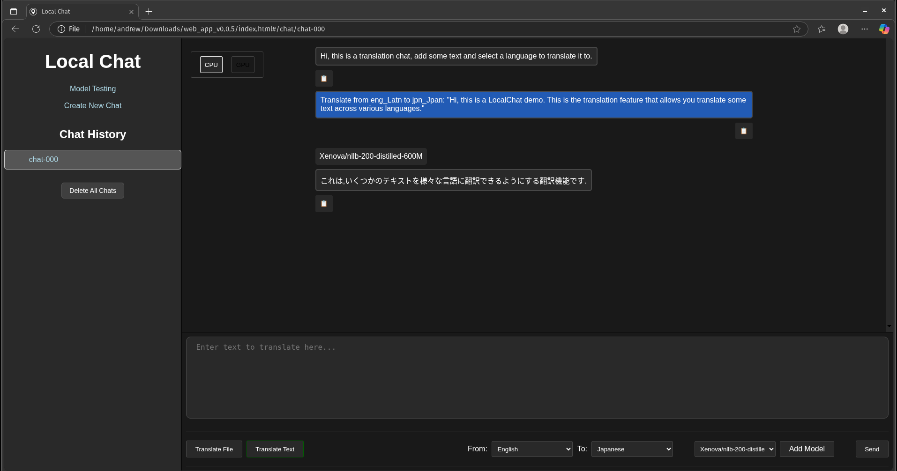

# What is LocalChat?

LocalChat is an AI chatbot that can analyse, summarise, translate, and answer questions given text-based documents as
input.

The app differentiates itself from other LLM services by running entirely locally within the user's web-browser.
The app does make any requests over the local-network or the internet - ensuring that your data exists only 
within your local device, and that the processing is sand-boxed and contained within the browser environment.

Additionally, the app does not require any software dependencies to run, making it ideal for use cases where 
confidentiality is of utmost importance.

This project was started as a university student project in collaboration with DEWC Services.

For more information see the links below:

- [LocalChat GitHub Repository](https://github.com/dewcservices/LocalChat)

- [Release Information](release_information.md)

# Developer Blogs

The following pages serve as a running blog to document the dev teams findings/progress throughout the project.

The blogs themselves vary between short miscellaneous findings, progress updates, design choices, and more. 

# Index

## Project Information

- [2025/03/10 Project Motivations](project_motivations.md)

## Miscellaneous

- [2025/03/11 Bundling & ONNX Runtime Web Testing](onnx_and_bundling_test.md)
- [2025/03/11 JavaScript Framework Choice](js_framework_choice.md)
- [2025/03/17 Running ONNX Models](running_onnx_models.md)
- [2025/03/21 Attempting to run T5 using ONNX Runtime Web](running_t5_onnxruntime_web.md)
- [2025/03/31 Xenova's Transformers JS](xenova_transformers.md)
- [2025/04/03 Issues with Xenova's Transformers JS](xenova_transformers_issues.md)
- [2025/04/30 Model Selection](model_selection_2025-04-30.md)
- [2025/05/07 Update on Distribution Packaging](dist_packaging_2025-05-07.md)
- [2025/05/15 Update on PDF Uploading and Rendering](pdf_upload_and_rendering.md)
- [2025/05/28 Making a model Transformers.js Compatible](model_conversion.md)
- [2025/08/28 Overview on Supported File Formats](overview_on_supported_file_types.md)
- [2025/08/28 Update on PDF Parsing Capability and Process Overview](PDF_parsing_update.md)
