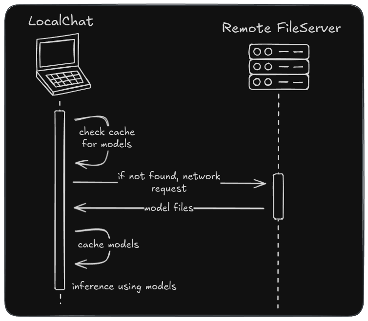
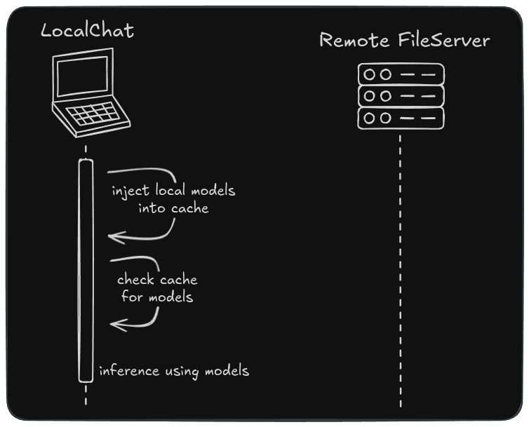

# Model Selection (as of 2025-04-30)

When using TransformersJS, models are fetched from a remote server then cached within the browser:

This is unideal for the project as this app needs to operate under air-gapped environments. Hence, the team has 
implemented a work-around.

The team has packaged some of the default/supported models within the app distribution. The user can then select a 
model directory and the app will inject the files into the cache:

